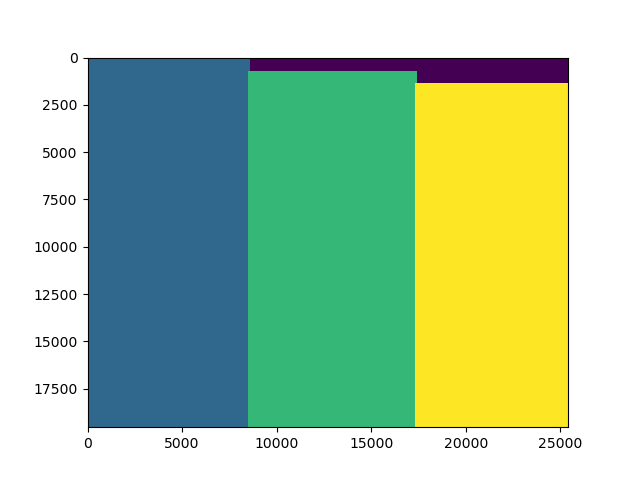

Quick start for the power balancing stage

This tutorial describe the training procedure for the balancing steps based on experiment_powerBalancing method of the Sentinel1Image class.

1. Training 
First, you need to get a dataset with statistics on balancing power for sub-blocks within subswaths.
To do that you should process a number of Sentinel-1 Level1 GRD files (we reccomend several tens).

For each file we do the following:

Import S1Image class and open an image we want to process
```python
from s1denoise import Sentinel1Image

s1 = Sentinel1Image('$YOUR_DATA_PATH/zip/S1A_IW_GRDH_1SDV_20200607T075151_20200607T075220_032908_03CFD7_9E14.zip')

```

Initialize number of lines for sub-block in wich we get averages in range direction. Also define the polarization we are inetersted
```python
numberOfLinesToAverage=1000
polarization='VH'
```

Cut a number of border pixels of the image. 100 px for IW data or 25 px for EW

```python
cPx = {'IW':100, 'EW':25}[s1.obsMode] 
```

Call subswathIndexMap method to get a matrix consistent with data matrix with sub-swath numbers from 1 to N, where N is the number of sub-swaths

```python
subswathIndexMap = s1.subswathIndexMap(polarization)
```

To illustrate the sub-swath mapping, a following figure is shown



where each color corresponds to sub-swath-number. In our case: blue - 1, green - 2, yellow - 3.

Then we get landmask, raw sigma zero and a ESA-provided sigma zero interpolated on a full data grid as well as making a copy of noiseEquivalentSigma0 into variable called rawNoiseEquivalentSigma0 as we are going to modify the raw noise to the scaled noise. 

```python
landmask = s1.landmask(skipGCP=4)
sigma0 = s1.rawSigma0Map(polarization)
noiseEquivalentSigma0 = s1.rawNoiseEquivalentSigma0Map(polarization, lutShift=True)
rawNoiseEquivalentSigma0 = noiseEquivalentSigma0.copy()
```

Next we read the noise scaling factors that have been obtained during the noise scaling stage

```python
noiseScalingParameters = s1.import_denoisingCoefficients(polarization)[0]
```

Scale the raw noise withing each sub-swath by the scaling coefficients

```python
for iSW in range(1, {'IW': 3, 'EW': 5}[s1.obsMode]+1):
  valid = (subswathIndexMap==iSW)
  noiseEquivalentSigma0[valid] *= noiseScalingParameters['%s%s' % (s1.obsMode, iSW)]
```

Get line numbers, where we have data (sub-swath number is not equal 0)

```python
validLineIndices = np.argwhere(np.sum(subswathIndexMap!=0,axis=1) == self.shape()[1])
```
 
Sub-block bounds based on the valid line numbers and the number of lines to average that we defined in the begining

```python
blockBounds = np.arange(validLineIndices.min(), validLineIndices.max(), numberOfLinesToAverage, dtype='uint')
```

Construct a dictonary where we put results and meta-data comprising: mode and sub-swath number, matrix with sigma zero, matrix with NESZ, balancingPower vector, vector with correlation coefficient and the noise fitting resiudal coefficient. IPF version number is stored as meta-data.

```python
results = { '%s%s' % (s1.obsMode, li):
                        { 'sigma0':[],
                          'noiseEquivalentSigma0':[],
                          'balancingPower':[],
                          'correlationCoefficient':[],
                          'fitResidual':[] }
                    for li in range(1, {'IW':3, 'EW':5}[s1.obsMode]+1) }
        results['IPFversion'] = self.IPFversion
```


